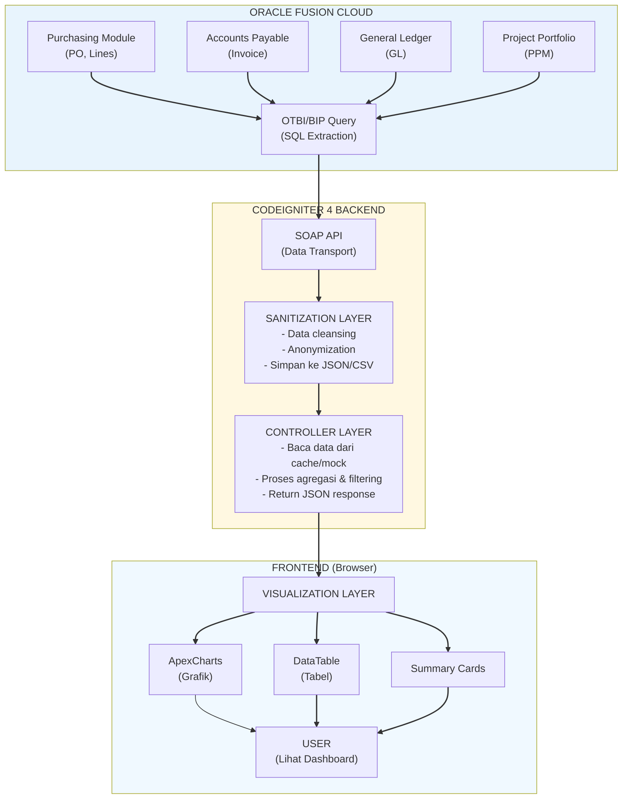
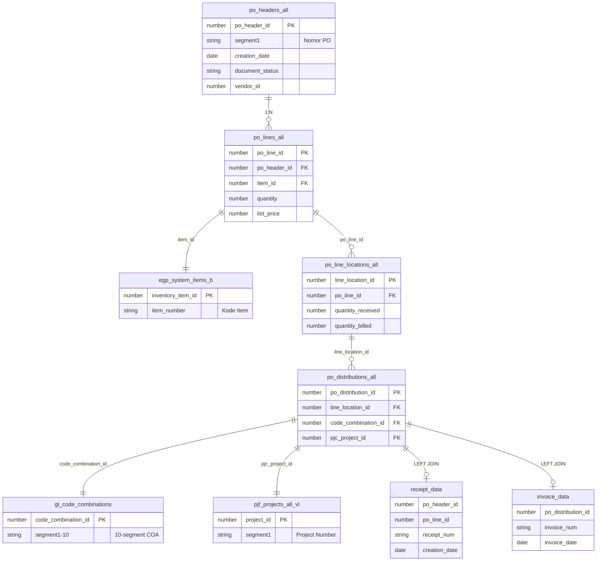

# Dashboard Laporan PO

Dashboard untuk monitoring data Purchase Order dari Oracle OTBI dengan visualisasi chart dan tabel interaktif.

## Fitur
- Real-time data dari Oracle OTBI via SOAP API
- Summary cards (Total PO, Total Value, dll)
- Multiple chart visualizations (Status PO, Jenis Pengadaan, dll)
- Search, filter, dan pagination
- Export CSV

## Stack
- Backend: PHP 8.1+ dengan CodeIgniter 4
- Frontend: HTML5, Tailwind CSS, JavaScript
- Charts: ApexCharts
- Data Source: Oracle OTBI SOAP API

---

## Dokumentasi Teknis

### 1. System Workflow (Data Flow Diagram)

Diagram ini menjelaskan bagaimana data "pindah" dari Oracle sampai ke user:



**Penjelasan Alur:**

1. **Extraction**: Data mentah diextract dari berbagai modul Oracle (Purchasing, AP, GL, PPM) menggunakan query SQL. Query ini berisi informasi lengkap tentang PO.

2. **Sanitization**: Data yang telah diextract dibersihkan terlebih dahulu (misal: menghapus karakter khusus, format tanggal). Untuk keperluan development/demo, data juga dilakukan anonymization untuk keamanan, kemudian disimpan dalam format JSON/CSV sebagai mock-database.

3. **Visualization**: CodeIgniter 4 membaca data tersebut, memproses agregasi, dan menampilkannya pada dashboard interaktif menggunakan library ApexCharts. Pengguna dapat melihat grafik, tabel, dan summary cards.

---

### 2. Data Relationship / Query Breakdown (SQL Logic)

#### CTE 1: `receipt_data`

**Tujuan**: Mengambil data penerimaan barang (receipt) terbaru untuk setiap line PO.

```sql
WITH receipt_data AS (
    SELECT rt.po_header_id,
           rt.po_line_id,
           rsh.receipt_num,
           rsh.creation_date,
           ROW_NUMBER() OVER (
               PARTITION BY rt.po_header_id, rt.po_line_id
               ORDER BY rsh.creation_date DESC
           ) AS rn
    FROM   rcv_transactions rt
           LEFT JOIN rcv_shipment_headers rsh
               ON rsh.shipment_header_id = rt.shipment_header_id
    WHERE  rt.transaction_type = 'RECEIVE'
      AND  rsh.receipt_num IS NOT NULL
)
```

Window function `ROW_NUMBER()` dipakai untuk mengambil receipt terbaru per PO line. Jika terdapat beberapa kali penerimaan, hanya yang terakhir yang akan diambil.

**Tabel yang terlibat**:
- `rcv_transactions` - Data transaksi penerimaan
- `rcv_shipment_headers` - Header shipment (nomor receipt)

---

#### CTE 2: `invoice_data`

**Tujuan**: Mengambil data invoice terbaru untuk setiap PO distribution.

```sql
invoice_data AS (
    SELECT aida.po_distribution_id,
           aia.invoice_num,
           aia.invoice_date,
           ROW_NUMBER() OVER (
               PARTITION BY aida.po_distribution_id
               ORDER BY aia.invoice_date DESC
           ) AS rn
    FROM   ap_invoice_distributions_all aida
           LEFT JOIN ap_invoices_all aia
               ON aia.invoice_id = aida.invoice_id
    WHERE  aia.invoice_num IS NOT NULL
      AND  aia.invoice_type_lookup_code IN ('STANDARD', 'PREPAYMENT', 'EXPENSE_REPORT')
)
```

Window function `ROW_NUMBER()` dipakai untuk mengambil invoice terbaru per distribution. Dilakukan filtering berdasarkan tipe invoice yang valid.

**Tabel yang terlibat**:
- `ap_invoice_distributions_all` - Distribusi invoice ke PO
- `ap_invoices_all` - Header invoice

---

#### Main Query: UNION STANDARD + BLANKET PO

Query utama menggunakan `UNION ALL` untuk menggabungkan dua jenis PO:

**STANDARD PO**: 
- PO langsung tanpa agreement/blanket
- Pengadaan one-time, pembelian langsung ke vendor
- Filter: `pha.type_lookup_code = 'STANDARD'` dan `pla.from_header_id IS NULL`

**BLANKET RELEASE PO**: 
- PO yang dibuat dari blanket agreement
- Digunakan untuk pengadaan berulang dengan harga yang telah disepakati
- Filter: Join ke `po_headers_all pha2` dimana `pha2.type_lookup_code = 'BLANKET'`

---

#### Relasi Antar Tabel (JOIN)



**Penjelasan JOIN utama**:

| Join | Dari | Ke | Keterangan |
|------|------|-----|------------|
| INNER | `po_headers_all` | `po_lines_all` | 1 PO punya banyak line |
| INNER | `po_lines_all` | `egp_system_items_b` | Ambil info item dari master |
| INNER | `po_lines_all` | `po_line_locations_all` | Lokasi pengiriman |
| INNER | `po_line_locations_all` | `po_distributions_all` | Distribusi akuntansi |
| INNER | `po_distributions_all` | `gl_code_combinations` | Chart of Account (10 segment) |
| INNER | `po_distributions_all` | `pjf_projects_all_vl` | Info project |
| LEFT | CTE `receipt_data` | - | Receipt terbaru (bisa null) |
| LEFT | CTE `invoice_data` | - | Invoice terbaru (bisa null) |

---

#### Field-Field Penting

| Field | Asal | Keterangan |
|-------|------|------------|
| `nomor_po` | `pha.segment1` | Nomor PO |
| `jumlah` | `pla.list_price * pla.quantity` | Total nilai line |
| `qty_ordered` | `pla.quantity` | Qty yang dipesan |
| `qty_received` | `line_loc.quantity_received` | Qty yang telah diterima |
| `qty_billed` | `line_loc.quantity_billed` | Qty yang telah di-invoice |
| `receipt_date` | `rd.creation_date` | Tanggal terima barang |
| `invoice_date` | `id.invoice_date` | Tanggal invoice |
| `jenis_po` | `pha.attribute12` | Klasifikasi PO |
| `jenis_pengadaan` | `pla.attribute6` | Tipe pengadaan |
| `po_charge_account` | `gcc.segment1-10` | GL Account 10 segment |
| `project_number` | `ppa.segment1` | Nomor project |
| `agreement` | `pha2.segment1` | Nomor blanket agreement (jika ada) |

---

#### Parameter Query

```sql
AND (TO_CHAR(pha.creation_date, 'YYYY') = :p_thn_buat_po
     OR NULLIF(:p_thn_buat_po, '') IS NULL)
```

Query ini memiliki parameter `:p_thn_buat_po` untuk filter berdasarkan tahun pembuatan PO. Jika parameter kosong atau null, semua data akan ditampilkan tanpa filter tahun.

